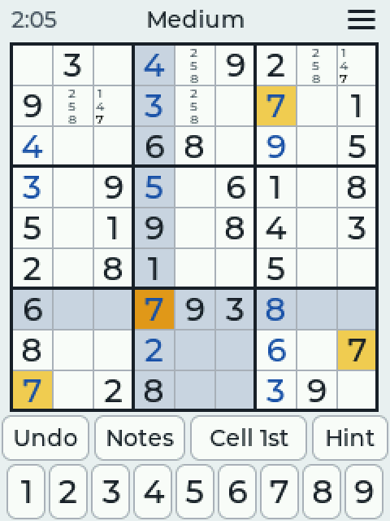
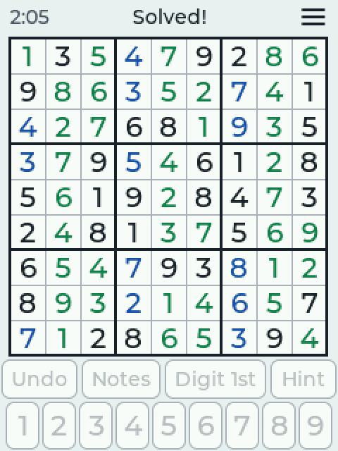
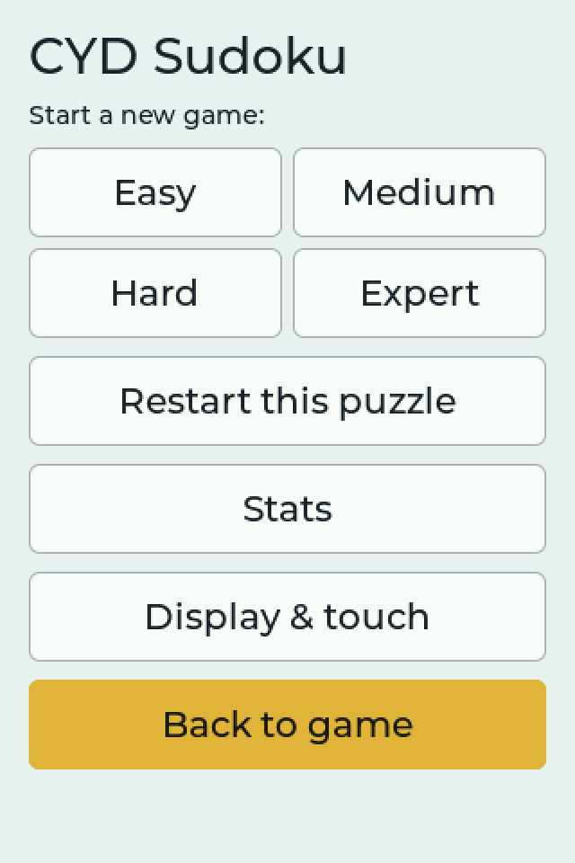
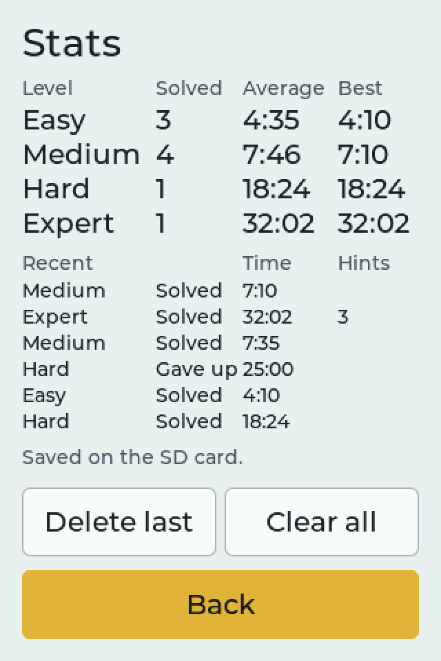
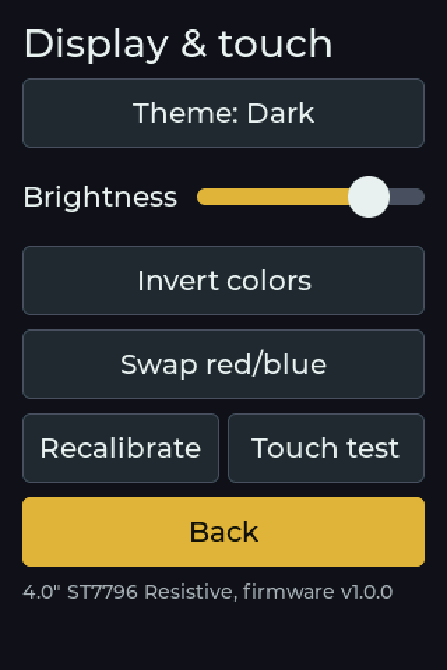

# CYD Sudoku

A polished, touch-friendly Sudoku for the ESP32 "Cheap Yellow Display" family.

> **Status:** v1.0. Puzzles are generated and graded on the device; see
> [docs/SPEC.md](docs/SPEC.md) for details.

## Screenshots

**2.8" and 3.2" boards (240×320)**: playing, Digit 1st with notes (dark
theme), a hint pointing at a cell, a solved board.

**3.5" and 4.0" boards (320×480)**: playing (with digits-left counts),
the ☰ menu, stats, Display & touch (dark theme).

## How to play

The screen, top to bottom: clock, difficulty and the **☰ menu**; the board;
the tool row (**Undo**, **Notes**, input mode, **Hint**); the digits 1-9.

- **Input mode** — the third button shows the current mode; tap it to switch.
  Remembered between games. **Digit 1st** is the default.
  - **Digit 1st:** tap a digit, then tap cells to place it. Tap a cell that
    already holds that digit to clear it; a different digit is replaced.
    Tap a given (black) digit to pick that digit. Picking a digit clears the
    cell highlight. When the last of a digit is placed it greys out and is
    deselected.
  - **Cell 1st:** tap a cell, then a digit. Tap the same digit again to
    clear it.
- **Notes:** while on, digits add or remove pencil marks instead of answers.
  Placing a digit removes it from the notes in its row, column and box.
- **Undo** steps back one action. Undoing a placement also brings back the
  notes it cleared.
- **Hint:** the first tap points at a cell (the top bar says "Tap Hint to
  fill"); a second tap fills in the right digit, shown in green and locked.
  It points at your selected cell if that one is empty or wrong, else at a
  wrong entry if there is one, else at the easiest empty cell. Hints are
  counted in your stats.
- On the 3.5" and 4.0" boards the small number under each digit is how many
  of that digit are left to place. The 2.8"/3.2" boards leave it out so the
  board can be bigger.
- Clashing digits are tinted red. A digit button greys out once all nine are
  placed correctly.
- **The clock** only runs while you play. After 2 minutes with no touch it
  stops and the top bar says **Paused**; the next touch starts it again. It
  can't run while the board is unplugged (the board has no clock battery),
  and it stops while the menu is open.
- **Solving** flashes the screen (colors invert a few times) and leaves the
  finished board on screen. Open the ☰ menu when you're ready for a new game.
- **☰ menu:** new game (Easy, Medium, Hard, Expert), restart, **Stats**, and
  **Display & touch** (Light/Dark theme, brightness, panel color fixes,
  touch calibration, touch test). Buttons act on the first tap; nothing asks
  "are you sure". The game saves itself and picks up where you left off.

## Difficulty

Every puzzle has exactly one solution, and its level is set by the hardest
solving technique it needs (checked by a built-in solver that works the way
a person does):

| Level | Needs | Never needs |
|---|---|---|
| Easy | naked and hidden singles only (36+ clues) | anything else |
| Medium | pointing / claiming (locked candidates) | pairs, triples, fish |
| Hard | naked/hidden pairs and triples, X-Wing | Swordfish, wings |
| Expert | Swordfish, XY-Wing or XYZ-Wing | chains or guessing |

No puzzle ever needs guessing. The grader was checked against 8,000 rated
puzzles from the public Sudoku Exchange puzzle bank. The board keeps two
puzzles of each level ready in the background, so new games start at once.

## Stats

Every solved puzzle is recorded with its difficulty, time and hints used. So
is every puzzle you leave for a new game after playing it (marked "Gave up").
The Stats screen shows solves, average and best time per difficulty, and
your most recent games. **Delete last** removes the most recent entry (for a
game recorded by mistake) and **Clear all** wipes the history.

- **With a microSD card** (3.2", 3.5" and 4.0" boards): saved to
  `CYD-Sudoku/stats.csv` on the card, full history, opens in Excel.
  Anything recorded before the card went in is moved onto it.
- **Without a card**, and on the 2.8" boards for now: saved in the board's
  memory (the most recent 250 games). The 2.8" board's SD slot shares a
  controller with its touch screen and needs a driver change first.

## Install

**Easiest:** open the [web flasher](https://tomtombombadil.github.io/CYD-Sudoku/)
in Chrome or Edge, plug in the board, pick it from the list and click Install.

Or download the `.bin` for your board from [Releases](../../releases) and
flash it at address **0x0** with Espressif's Flash Download Tool.

## Supported boards

Boards are named by screen size, display driver and touch type. Check the
text printed on the back of the board.

| Firmware file | Printed on the back |
|---|---|
| `CYD_2.8in_ILI9341_Resistive.bin` | ESP32-2432S028 (often with R) — usually single micro-USB |
| `CYD_2.8in_ST7789_Resistive.bin` | ESP32-2432S028 (often with R) — usually micro-USB + USB-C |
| `CYD_3.2in_ST7789_Resistive.bin` | 3.2" LCD Display, ESP32-32E, 240x320, Resistive Touch |
| `CYD_3.5in_ST7796_Resistive.bin` | 3.5" LCD Display, ESP32-32E, 320x480, Resistive Touch |
| `CYD_4.0in_ST7796_Resistive.bin` | 4.0" LCD Display, ESP32-32E, 320x480, Resistive Touch |

Confirmed working: 2.8" ST7789, 3.2" ST7789, 4.0" ST7796.

**Untested:** the 2.8" ILI9341 and 3.5" ST7796 builds use the same code and
pin maps as their tested siblings but haven't been run on that hardware.
They should work; please [open an issue](../../issues) either way. NM-CYD-C5
(ESP32-C5) support may come after v1.0.

Not sure which 2.8" you have? Try ILI9341 first. Wrong colors: see below.
Garbled or blank screen: install the other 2.8" version.

## Building (Windows, VS Code + PlatformIO)

1. Install VS Code and the **PlatformIO IDE** extension.
2. Clone this repo and open the folder in VS Code.
3. In the blue status bar, click the `env:` selector and choose your board
   (e.g. `cyd32_st7789_res` for the 3.2" ST7789 board).
4. Click **Build** (✓), then **Upload** (→) with the board plugged in.
5. **Serial Monitor** (plug icon) shows boot logs at 115200 baud.

## Brightness

**☰ → Display & touch → Brightness** sets the backlight. It never goes fully
dark, and it's remembered.

## Touch calibration

On first boot (or when the **BOOT** button is held while powering on), the
screen shows corner arrows — tap each tip precisely. The calibration is saved
to flash and reused. To redo it: **☰ → Display & touch → Recalibrate**.

## Colors look wrong?

Panels vary between production runs. Open **☰ → Display & touch**: use
**Invert colors** if colors look like a photo negative, and **Swap red/blue**
if the blue digits show as red. The fix is saved on the board.
For a dark screen on purpose, use **Theme: Dark** instead.

## License

[MIT](LICENSE). Third-party components and what may be borrowed from where:
[THIRD_PARTY_NOTICES.md](THIRD_PARTY_NOTICES.md).
